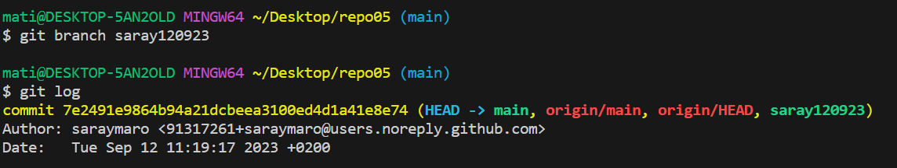
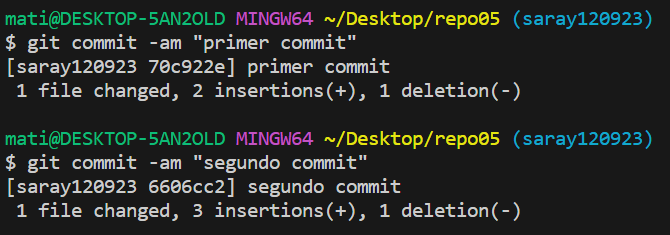
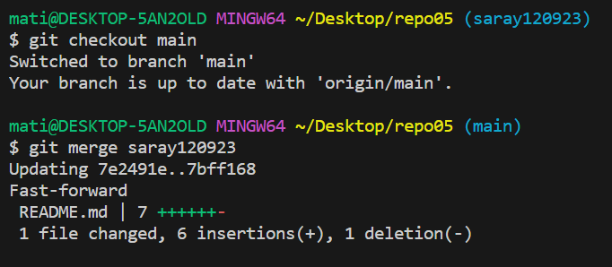
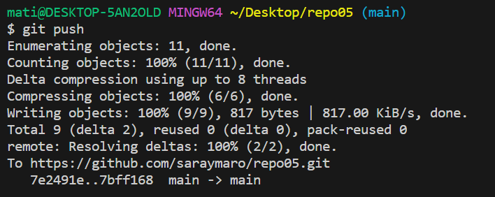
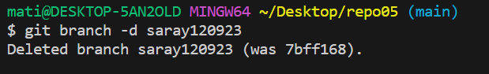
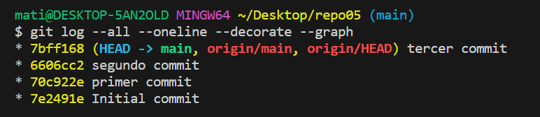
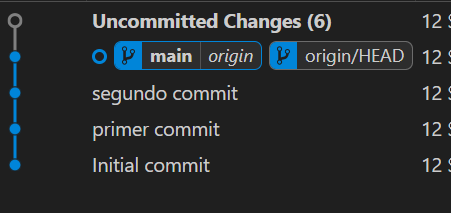

# Ejercicio 4
Creamos un repostorio en github y lo clonamos.
>
Creamos una rama con git branch.

>
Creamos los dos primeros commits.

>
Hacemos merge para fusionar la rama creada con la rama main.

>
Lo subimos haciendo push.

>
Eliminamos la rama que habíamos creado.

>
Visualizamos como ha quedado con git log "alog" y vemos que ahora todo está en el último commit.

>
Vemos con el plugin de manera más visual el estado.